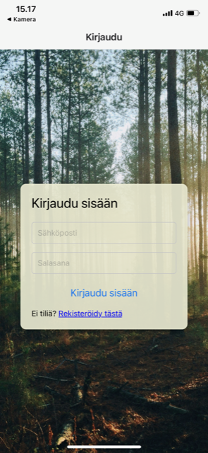
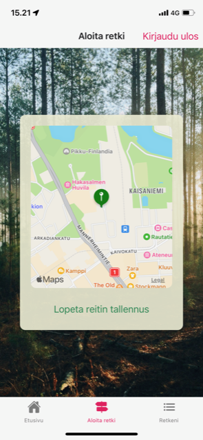
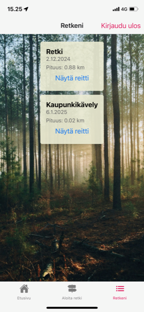
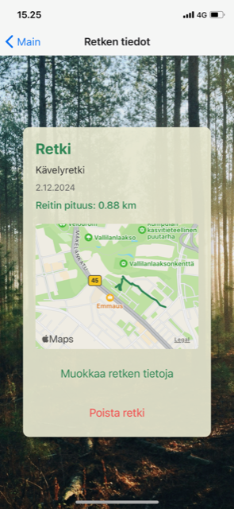
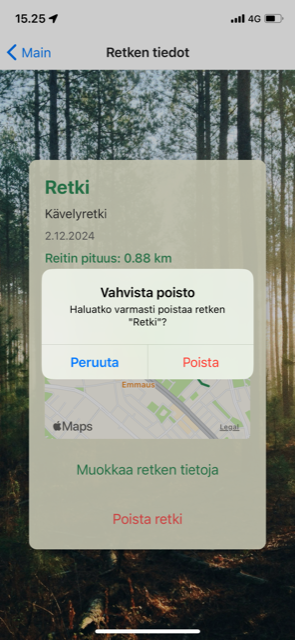
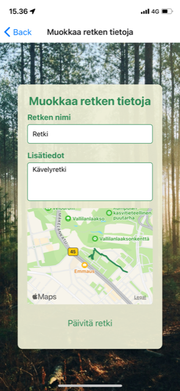

# Retkisovellus

Tämä ohjelmointiprojekti on Mobiiliohjelmointi-kurssin lopputyö Haaga-Helia ammattikorkeakoulussa. Sovelluksen pääideana on tallentaa käyttäjän kulkemia reittejä.

## Toiminnallisuudet
- Käyttäjä voi rekisteröityä ja kirjautua sovelluksen käyttäjäksi
- Käyttäjä voi lisätä, muokata ja poistaa omat retkitietonsa
- Jokainen käyttäjä näkee vain omat retkitietonsa
- Retket ovat listattuina Retkeni-sivulla
- Käyttäjän kulkema reitti piirretään kartalle
- Käyttäjän kulkeman reitin pituus lasketaan

## Käytetyt teknologiat
- React Native
  - Käytetty mobiilisovelluksen kehittämiseen.
  - Käyttöliittymäkomponentit: View, Text, TextInput, Button, StyleSheet.
- React Native Maps
  - Käytetään kartan näyttämiseen ja käyttäjän reittien piirtämiseen kartalle.
- React
  - Tarjoaa sovellukselle komponenttipohjaisen rakenteen ja tilanhallinnan.
- React Navigation
  - Mahdollistaa navigoinnin sovelluksen eri näkymien välillä.
- Expo CLI
  - Mahdollistaa React Native -sovelluksen kehittämisen ja testaamisen nopeasti.
- Expo Go
  - Käytetään sovelluksen testaamiseen suoraan älypuhelimella (testauksessa käytetty iPhone X).
- Firebase Authentication
  - Käytetty käyttäjänhallintaan. Mahdollistaa käyttäjien rekisteröitymisen, kirjautumisen ja uloskirjautumisen.
- Firebase Realtime Database
  - Käytetty tiedon tallentamiseen reaaliaikaisesti. Retkien tiedot, kuten reitit, nimet ja lisätiedot, tallennetaan tietokantaan käyttäjäkohtaisesti.
- JavaScript
  - Sovelluksen ohjelmointikieli.
- Haversinen kaava
  - Käytetään laskemaan todellinen etäisyys reitin pisteiden välillä, huomioiden maapallon kaarevuus.
- VS Code
  - Sovelluksen kehitysympäristö.

## Kuvia

Käyttäjän tulee rekisteröityä voidakseen tallentaa retkitietoja. Jokaisella käyttäjällä on oma uniikki käyttäjätunnus ja salasana. Rekisteröitymisen
jälkeen käyttäjä voi kirjautua.

Kirjautumisen jälkeen käyttäjä pääsee etusivulle. Alavalikon kautta hän voi siirtyä reittien lisäykseen tai katsella jo tehtyjä retkiä.

Aloita retki-välilehdellä käyttäjä voi aloittaa uuden retken reitin tallentamisen. Kun käyttää painaa "aloita reitin tallennus", hänen sijaintinsa paikannetaan kartalle.
Käyttäjän reitti piirretään kartalle. Reitin tallennus päättyy, kun käyttäjä painaa "lopeta reitin tallennus".

Käyttäjän tulee rekisteröityä voidakseen lisätä kuluja järjestelmään. Jokaisella käyttäjällä on oma uniikki käyttäjätunnus ja salasana. Käyttäjä saa
ilmoituksen, mikäli käyttäjätunnus on jo varattu.

Käyttäjän tulee rekisteröityä voidakseen lisätä kuluja järjestelmään. Jokaisella käyttäjällä on oma uniikki käyttäjätunnus ja salasana. Käyttäjä saa
ilmoituksen, mikäli käyttäjätunnus on jo varattu.

Käyttäjän tulee rekisteröityä voidakseen lisätä kuluja järjestelmään. Jokaisella käyttäjällä on oma uniikki käyttäjätunnus ja salasana. Käyttäjä saa
ilmoituksen, mikäli käyttäjätunnus on jo varattu.

Käyttäjän tulee rekisteröityä voidakseen lisätä kuluja järjestelmään. Jokaisella käyttäjällä on oma uniikki käyttäjätunnus ja salasana. Käyttäjä saa
ilmoituksen, mikäli käyttäjätunnus on jo varattu.

Käyttäjän tulee rekisteröityä voidakseen lisätä kuluja järjestelmään. Jokaisella käyttäjällä on oma uniikki käyttäjätunnus ja salasana. Käyttäjä saa
ilmoituksen, mikäli käyttäjätunnus on jo varattu.

